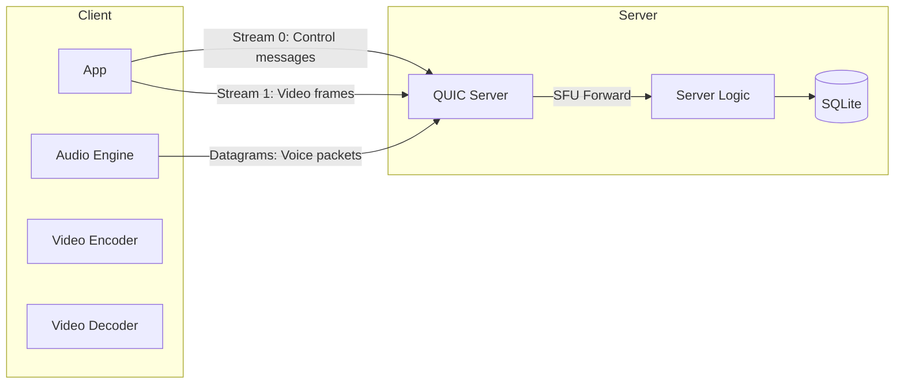
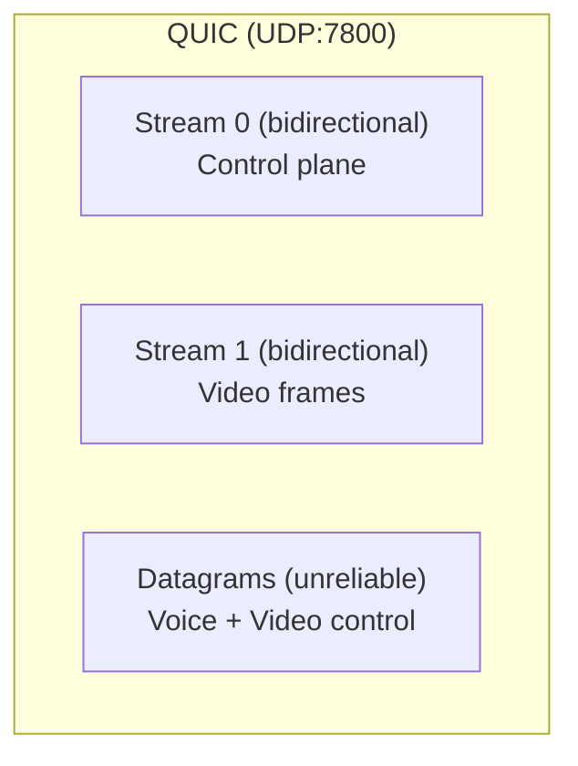
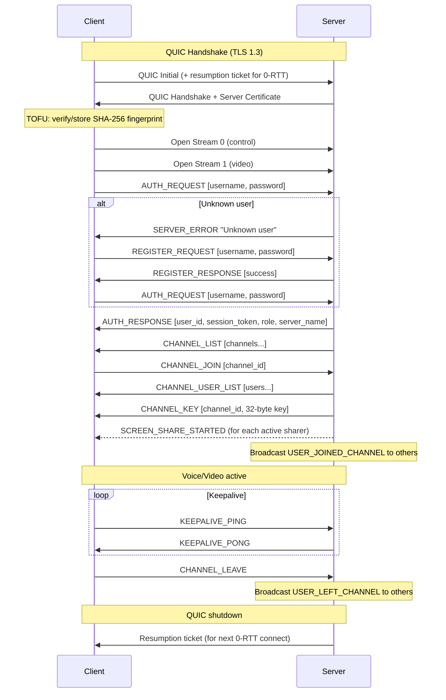
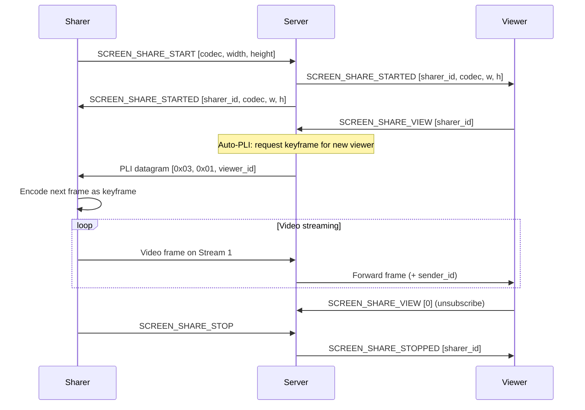
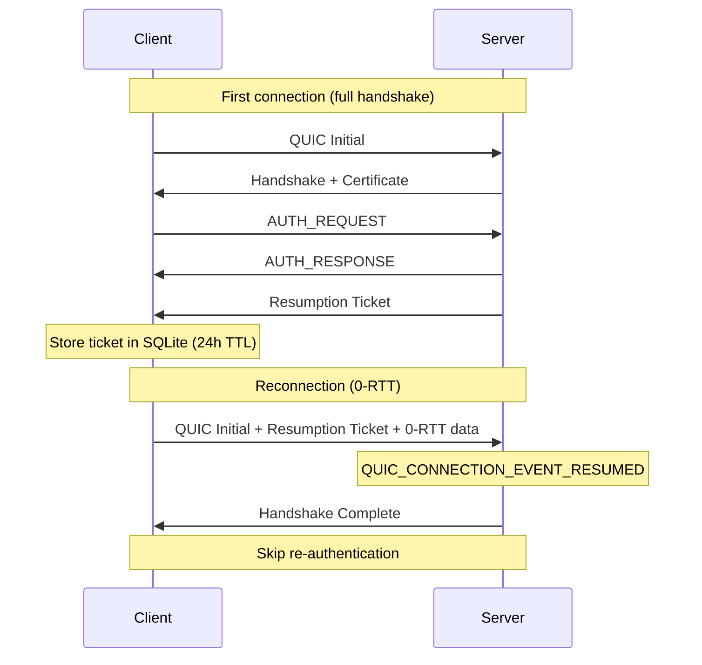

# Parties Networking Protocol

> Version 1.0 -- March 2026

## 1. Overview

Parties is a self-hosted VOIP application with screen sharing. All communication runs over a single **QUIC** connection on **UDP port 7800**.

| Layer | Transport | Purpose |
|-------|-----------|---------|
| Control plane | QUIC bidirectional stream 0 | Auth, channels, admin, screen share signaling |
| Video plane | QUIC bidirectional stream 1 | Screen share frames (reliable, ordered) |
| Voice plane | QUIC datagrams | Opus audio (unreliable, unordered) |
| Video control | QUIC datagrams | PLI keyframe requests |

- **ALPN**: `parties` (7 bytes)
- **TLS**: 1.3 via wolfSSL (QUIC-aware)
- **Certificates**: Self-signed RSA-4096, verified via TOFU
- **Idle timeout**: 30 seconds
- **Session resumption**: 0-RTT via resumption tickets

## 2. Architecture





## 3. Connection Lifecycle



## 4. Message Framing

All control messages on Stream 0 use length-prefixed framing:

```
 0                   1                   2                   3
 0 1 2 3 4 5 6 7 8 9 0 1 2 3 4 5 6 7 8 9 0 1 2 3 4 5 6 7 8 9 0 1
+-+-+-+-+-+-+-+-+-+-+-+-+-+-+-+-+-+-+-+-+-+-+-+-+-+-+-+-+-+-+-+-+
|                        Length (u32 LE)                        |
+-+-+-+-+-+-+-+-+-+-+-+-+-+-+-+-+-+-+-+-+-+-+-+-+-+-+-+-+-+-+-+-+
|        Message Type (u16 LE)  |         Payload...            |
+-+-+-+-+-+-+-+-+-+-+-+-+-+-+-+-+-+-+-+-+-+-+-+-+-+-+-+-+-+-+-+-+
```

- **Length**: Size of message type + payload (not including the 4-byte length field itself)
- **Byte order**: Little-endian for all integers
- **Max message size**: 1,048,576 bytes (1 MB)
- **String encoding**: `[u16 length][UTF-8 bytes]`

## 5. Control Messages Reference

### 5.1 Authentication

#### AUTH_REQUEST (0x0001) -- C->S

| Field | Type | Description |
|-------|------|-------------|
| username | string | User's login name |
| password | string | User's password (plaintext, protected by TLS) |

If the server has `server_password` configured, the client appends it as a third string field.

#### AUTH_RESPONSE (0x0101) -- S->C

| Field | Type | Size | Description |
|-------|------|------|-------------|
| user_id | u32 | 4 | Assigned user ID |
| session_token | bytes | 32 | Random session token |
| role | u8 | 1 | User role (see [Roles](#9-permissions--roles)) |
| server_name | string | 2+N | Server display name |

#### REGISTER_REQUEST (0x0006) -- C->S

| Field | Type | Description |
|-------|------|-------------|
| username | string | Desired username (1-32 characters) |
| password | string | Password (6+ characters) |

#### REGISTER_RESPONSE (0x0108) -- S->C

| Field | Type | Description |
|-------|------|-------------|
| success | u8 | 1 = success, 0 = failure |
| message | string | Error message (on failure) |

#### SERVER_ERROR (0x01FF) -- S->C

| Field | Type | Description |
|-------|------|-------------|
| message | string | Human-readable error description |

### 5.2 Channels

#### CHANNEL_JOIN (0x0002) -- C->S

| Field | Type | Size | Description |
|-------|------|------|-------------|
| channel_id | u32 | 4 | Channel to join |

#### CHANNEL_LEAVE (0x0003) -- C->S

No payload.

#### CHANNEL_LIST (0x0102) -- S->C

| Field | Type | Description |
|-------|------|-------------|
| count | u32 | Number of channels |
| *per channel:* | | |
| id | u32 | Channel ID |
| name | string | Channel name |
| max_users | u32 | Maximum users (0 = unlimited) |
| sort_order | u32 | Display sort order |
| user_count | u32 | Current number of users |

#### CHANNEL_USER_LIST (0x0103) -- S->C

| Field | Type | Description |
|-------|------|-------------|
| channel_id | u32 | Channel ID |
| count | u32 | Number of users |
| *per user:* | | |
| user_id | u32 | User ID |
| username | string | Display name |
| role | u8 | Role (0-3) |
| muted | u8 | 1 = self-muted |
| deafened | u8 | 1 = self-deafened |

#### USER_JOINED_CHANNEL (0x0104) -- S->C

| Field | Type | Description |
|-------|------|-------------|
| user_id | u32 | User who joined |
| username | string | Their display name |
| channel_id | u32 | Channel they joined |

#### USER_LEFT_CHANNEL (0x0105) -- S->C

| Field | Type | Description |
|-------|------|-------------|
| user_id | u32 | User who left |
| channel_id | u32 | Channel they left |

#### CHANNEL_KEY (0x0109) -- S->C

| Field | Type | Size | Description |
|-------|------|------|-------------|
| channel_id | u32 | 4 | Channel ID |
| key | bytes | 32 | Per-channel encryption key |

Sent immediately after the user joins a channel. The key is generated on first join and cached server-side.

### 5.3 Keepalive

#### KEEPALIVE_PING (0x0004) -- C->S

No payload. Client sends periodically to prevent idle timeout.

#### KEEPALIVE_PONG (0x0107) -- S->C

No payload. Server echoes back immediately.

### 5.4 Screen Sharing Signaling

#### SCREEN_SHARE_START (0x0007) -- C->S

| Field | Type | Size | Description |
|-------|------|------|-------------|
| codec | u8 | 1 | Video codec ID |
| width | u16 | 2 | Capture width in pixels |
| height | u16 | 2 | Capture height in pixels |

#### SCREEN_SHARE_STOP (0x0008) -- C->S

No payload.

#### SCREEN_SHARE_VIEW (0x0009) -- C->S

| Field | Type | Size | Description |
|-------|------|------|-------------|
| target_user_id | u32 | 4 | Sharer to subscribe to (0 = unsubscribe) |

#### SCREEN_SHARE_STARTED (0x010A) -- S->C

| Field | Type | Size | Description |
|-------|------|------|-------------|
| sharer_user_id | u32 | 4 | Who started sharing |
| codec | u8 | 1 | Video codec ID |
| width | u16 | 2 | Capture width |
| height | u16 | 2 | Capture height |

Broadcast to all users in the channel.

#### SCREEN_SHARE_STOPPED (0x010B) -- S->C

| Field | Type | Size | Description |
|-------|------|------|-------------|
| sharer_user_id | u32 | 4 | Who stopped sharing |

#### SCREEN_SHARE_DENIED (0x010C) -- S->C

| Field | Type | Description |
|-------|------|-------------|
| reason | string | Why the share was denied |

### 5.5 Admin Operations

#### ADMIN_CREATE_CHANNEL (0x0201) -- C->S

| Field | Type | Description |
|-------|------|-------------|
| name | string | Channel name |
| max_users | u32 | Max users (0 = server default) |

Requires `CreateChannel` permission.

#### ADMIN_DELETE_CHANNEL (0x0202) -- C->S

| Field | Type | Size | Description |
|-------|------|------|-------------|
| channel_id | u32 | 4 | Channel to delete |

Requires `DeleteChannel` permission. All users in the channel are kicked first.

#### ADMIN_SET_ROLE (0x0203) -- C->S

| Field | Type | Size | Description |
|-------|------|------|-------------|
| target_user_id | u32 | 4 | User to modify |
| new_role | u8 | 1 | New role (0-3) |

Cannot promote above your own role. Requires `ManageRoles` permission.

#### ADMIN_KICK_USER (0x0204) -- C->S

| Field | Type | Size | Description |
|-------|------|------|-------------|
| target_user_id | u32 | 4 | User to kick |

Requires `KickFromServer` permission.

#### ADMIN_RESULT (0x0301) -- S->C

| Field | Type | Description |
|-------|------|-------------|
| success | u8 | 1 = success, 0 = failure |
| message | string | Result description |

## 6. Voice Data Plane

Voice audio is sent as QUIC datagrams (unreliable, unordered) for minimal latency.

### Packet format

**Client sends:**

```
+------+----------------------------+
| 0x01 |      Opus encoded audio    |
| 1 B  |       variable length      |
+------+----------------------------+
```

**Server forwards (SFU):**

```
+------+-----------+----------------------------+
| 0x01 | sender_id |      Opus encoded audio    |
| 1 B  |   4 B LE  |       variable length      |
+------+-----------+----------------------------+
```

The server **never decodes** voice data. It prepends the sender's user ID and forwards to all authenticated users in the same channel who are not deafened.

### Opus codec parameters

| Parameter | Value |
|-----------|-------|
| Sample rate | 48,000 Hz |
| Channels | 1 (mono) |
| Frame size | 960 samples (20 ms) |
| RNNoise frame | 480 samples (10 ms, 2 per Opus frame) |
| Default bitrate | 32 kbps |
| Max packet size | 512 bytes |

## 7. Video Data Plane

Screen share video frames are sent on **QUIC Stream 1** (reliable, ordered) for guaranteed delivery of keyframes and codec state.

### Frame format on Stream 1

Each frame is length-prefixed on the stream:

```
+------------------+------+-------+-------+-------+-------+-------+-------+------------+
| frame_len (u32)  | 0x02 |  fn   |  ts   | flags | width |height | codec | encoded    |
|      4 B LE      | 1 B  | 4B LE | 4B LE |  1 B  | 2B LE | 2B LE|  1 B  | variable   |
+------------------+------+-------+-------+-------+-------+-------+-------+------------+
```

| Field | Type | Description |
|-------|------|-------------|
| frame_len | u32 | Length of everything after this field |
| packet_type | u8 | Always `0x02` (VIDEO_FRAME_PACKET_TYPE) |
| frame_number | u32 | Sequential frame counter |
| timestamp | u32 | Presentation timestamp (= frame_number) |
| flags | u8 | Bitfield: bit 0 = keyframe |
| width | u16 | Frame width in pixels |
| height | u16 | Frame height in pixels |
| codec | u8 | Video codec ID |
| encoded_data | bytes | Codec-compressed video data |

**Server forwards** with sender_id inserted after the packet type byte.

### Video codec IDs

| ID | Codec | Notes |
|----|-------|-------|
| 0x01 | AV1 | Preferred, decoded with dav1d |
| 0x02 | H.265 | Fallback |
| 0x03 | H.264 | Last resort |

### Bitrate limits

| Parameter | Value |
|-----------|-------|
| Maximum bitrate | 5 Mbps |
| Default bitrate | 2 Mbps |
| Minimum bitrate | 200 kbps |
| Max keyframe interval | 5 seconds |
| PLI cooldown | 500 ms minimum between sends |

### Video control datagrams

Video control messages are sent as QUIC datagrams:

```
+------+---------+-------------------+
| 0x03 | subtype |    payload        |
| 1 B  |   1 B   |    variable       |
+------+---------+-------------------+
```

| Subtype | ID | Payload | Description |
|---------|----|---------|-------------|
| PLI | 0x01 | target_user_id (u32) | Request keyframe from sharer |
| SHARE_START | 0x02 | -- | (reserved) |
| SHARE_STOP | 0x03 | -- | (reserved) |

## 8. Screen Sharing Protocol



Key properties:
- **Multiple sharers per channel**: Each viewer picks which sharer to watch
- **Subscription-based delivery**: Video only flows to viewers who explicitly subscribe
- **Auto-PLI on subscribe**: Server sends immediate PLI so new viewers get a keyframe
- **Late-join notifications**: When joining a channel, server sends SCREEN_SHARE_STARTED for each active sharer

## 9. Permissions & Roles

### Role hierarchy

| Role | Value | Description |
|------|-------|-------------|
| Owner | 0 | Full control, all permissions |
| Admin | 1 | Manage channels, roles, kick users |
| Moderator | 2 | Mute/deafen others, kick from channel |
| User | 3 | Join channels and speak |

Higher-privilege roles can moderate lower ones but not equal or above. Owners cannot be moderated.

### Permission bitfield (u32)

| Bit | Permission | Owner | Admin | Mod | User |
|-----|------------|:-----:|:-----:|:---:|:----:|
| 0 | JoinChannel | x | x | x | x |
| 1 | Speak | x | x | x | x |
| 2 | MuteOthers | x | x | x | |
| 3 | DeafenOthers | x | x | x | |
| 4 | KickFromChannel | x | x | x | |
| 5 | KickFromServer | x | x | | |
| 6 | CreateChannel | x | x | | |
| 7 | DeleteChannel | x | x | | |
| 8 | ManagePermissions | x | x | | |
| 9 | ManageRoles | x | x | | |
| 10 | ManageServer | x | x | | |
| 11 | SendText | x | | | |
| 12 | UploadFiles | x | | | |
| 13 | ShareScreen | x | | | |
| 14 | ShareWebcam | x | | | |

Default permission masks:

| Role | Hex | Bits |
|------|-----|------|
| Owner | `0xFFFFFFFF` | All |
| Admin | `0x000007FF` | 0-10 |
| Moderator | `0x0000001F` | 0-4 |
| User | `0x00000003` | 0-1 |

## 10. Security Model

### Transport encryption

All data is encrypted by QUIC's built-in TLS 1.3 layer (wolfSSL with QUIC support).

### Server certificates

- **Algorithm**: RSA-4096 with SHA-256
- **Type**: Self-signed, auto-generated on first server run
- **Storage**: PEM files (`server.pem`, `server.key.pem`)
- **Validation**: Trust On First Use (TOFU)
  - Client computes SHA-256 fingerprint of server's DER certificate
  - First connection: silently stored in client's SQLite database
  - Subsequent connections: compared against stored fingerprint
  - Mismatch: connection aborted (possible MITM)

### Password security

| Parameter | Value |
|-----------|-------|
| Algorithm | Argon2id |
| Time cost | 3 iterations |
| Memory cost | 65,536 KB (64 MB) |
| Parallelism | 1 |
| Hash length | 32 bytes |
| Salt length | 16 bytes (random) |

### Channel key

A per-channel 32-byte symmetric key is distributed via the CHANNEL_KEY control message. The key is generated on first join and cached server-side. Currently used for channel membership verification; voice and video are protected by QUIC's TLS 1.3 transport encryption.

## 11. Session Resumption & 0-RTT



- **Ticket storage**: SQLite `resumption_tickets` table, keyed by `(host, port)`
- **TTL**: 24 hours (expired tickets are not loaded)
- **Security**: Tickets are deleted on TOFU fingerprint mismatch
- **Server config**: `ServerResumptionLevel = RESUME_AND_ZERORTT`

## 12. Constants & Configuration

### Network

| Constant | Value | Source |
|----------|-------|--------|
| Default port | 7800 | `protocol.h` |
| ALPN | `"parties"` | `quic_common.h` |
| Idle timeout | 30,000 ms | QUIC settings |
| Max bidirectional streams | 2 | QUIC settings |
| Max control message | 1,048,576 bytes | `net_client.cpp` |

### Types

| Type | Definition | Size |
|------|-----------|------|
| UserId | `uint32_t` | 4 bytes |
| ChannelId | `uint32_t` | 4 bytes |
| SessionToken | `array<uint8_t, 32>` | 32 bytes |
| ChannelKey | `array<uint8_t, 32>` | 32 bytes |

### Data plane packet types

| Type | Value | Transport |
|------|-------|-----------|
| Voice | `0x01` | Datagram |
| Video frame | `0x02` | Stream 1 |
| Video control | `0x03` | Datagram |

### SFU forwarding model

The server operates as a **Selective Forwarding Unit** (SFU):

- Voice packets are forwarded to all authenticated users in the same channel (excluding sender and deafened users)
- Video frames are forwarded only to explicitly subscribed viewers
- The server **never decodes** audio or video -- it only prepends the sender's user ID and routes packets
